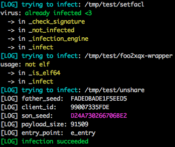
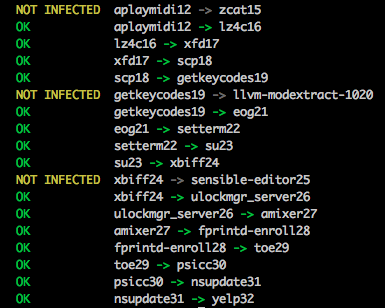

# Death

A metamorphic Virus for Elf64 binaries

## Installation

This might trigger your anti-virus, which is normal. Use at your own risk!

```bash
# clone it
git clone https://github.com/spolowy/Death.git && cd Death
# build it and run it
make && ./death
# remove installation files
cd .. && rm -rf Death
```

## Features

Play around with the colourful debug mode!



Experiment with different build modes:

```bash
# build with error logs and backtrace
make errors
# build with additional logs (+ errors)
make logs
```

Test or benchmark the virus polymorphism with:

```bash
# infect binaries for 200 generations with compile mode "re"
./scripts/test_spread.bash re 200 /bin/*
```



```bash
# benchmark polymorphism on 2 identical infected binaries
./scripts/test_vimdiff.bash re /bin/ls
```


```bash
# benchmark block permutation
./scripts/rainbow_spread.bash
```


## Insides

#### Featuring

* tiny polymorphic loader with register permutation
* random size code blocks permutated virus body
* instruction permutation for the virus body
* two entry point alternatives:
    * `e_entry` in elf header
    * overriding the first `jmp` instruction in the infected binary's code

#### Infection method

```
Section Headers:
  [Nr] Name              Type            Address          Off    Size   ES Flg Lk Inf Al
  [ 0]                   NULL            0000000000000000 000000 000000 00      0   0  0
  [ 1] .interp           PROGBITS        0000000000000318 000318 00001c 00   A  0   0  1
  [ 2] .note.gnu.property NOTE            0000000000000338 000338 000020 00   A  0   0  8
  [ 3] .note.gnu.build-id NOTE            0000000000000358 000358 000024 00   A  0   0  4
  [ 4] .note.ABI-tag     NOTE            000000000000037c 00037c 000020 00   A  0   0  4
  [ 5] .gnu.hash         GNU_HASH        00000000000003a0 0003a0 0000e4 00   A  6   0  8
  [ 6] .dynsym           DYNSYM          0000000000000488 000488 000d08 18   A  7   1  8
  [ 7] .dynstr           STRTAB          0000000000001190 001190 00064c 00   A  0   0  1
  [ 8] .gnu.version      VERSYM          00000000000017dc 0017dc 000116 02   A  6   0  2
  [ 9] .gnu.version_r    VERNEED         00000000000018f8 0018f8 000070 00   A  7   1  8
  [10] .rela.dyn         RELA            0000000000001968 001968 001350 18   A  6   0  8
  [11] .rela.plt         RELA            0000000000002cb8 002cb8 0009f0 18  AI  6  25  8
  VIRUS GOES HERE <-
  [12] .init             PROGBITS        0000000000004000 004000 00001b 00  AX  0   0  4
  [13] .plt              PROGBITS        0000000000004020 004020 0006b0 10  AX  0   0 16
  [14] .plt.got          PROGBITS        00000000000046d0 0046d0 000030 10  AX  0   0 16
  [15] .plt.sec          PROGBITS        0000000000004700 004700 0006a0 10  AX  0   0 16
  ...
```

> Tested on Ubuntu 20.04.1 x86_64

## Nota Bene

This virus does not contain any malicious software (or payload), it exists only for educational purposes.
