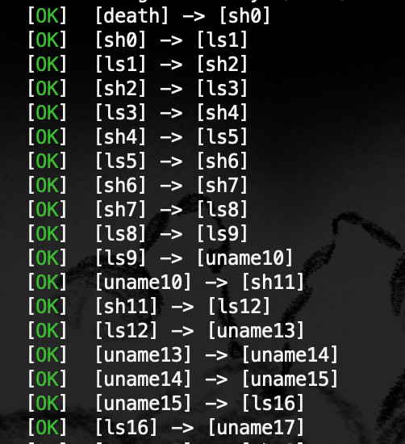

# Death

A metamorphic Virus for Elf64 binaries

## Installation

This might trigger your anti-virus, which is normal. Use at your own risk!

```bash
# clone it
git clone https://github.com/spolowy/Death.git && cd Death
# build it and run it
make && ./death
# remove installation files
cd .. && rm -rf Death
```

## Features

Play around with the colourful debug mode!


Experiment with different build modes:

```bash
# build with virus logs
make logs
# build with error logs and backtrace
make errors
# build in debug mode
make debug
```

Test or benchmark the virus polymorphism with:

```bash
# infect binaries for 200 generations with compile mode "re"
./scripts/test_spread.bash re 200 /bin/ls /bin/sh /bin/uname
```



```bash
# benchmark polymorphism on 2 identical infected binaries
./scripts/test_vimdiff.bash re /bin/ls
```


```bash
# benchmark polymorphism from generation to generation
./scripts/rainbow_spread.bash
```


## Insides

* Featuring a tiny polymorphic loader with register permutation
* And a random size code blocks permutated virus body

```
  Infected program memory overview
  ================================

                          .        .
                          |  ...   |
              p_offset -> |========| PT_LOAD  - relative_pt_load_address
                          |  ...   |          ^
                          |  ...   |          |
             sh_offset -> |--------|          |
                      |   |  ...   |          |
                      V   |  ...   |          |
    offset_in_section -   |>>>>>>>>| entry    |- relative_entry_address
                          |  ...   |          |^
                          |--------|          ||
                          |  ...   |          ||
                          |  ...   |          ||
   end_of_last_section -> |--------| -  -  -  -- -  -  -  -  -  -
         @loader_entry -> |@@@@@@@@| |                          |
                          |@      @| |                          |
                          |@      @| |                          |
                          |@@@@@@@@| V                          |
      encrypted @virus -> |~~~~~~~~| - relative_virus_addresss  |
                          |########| |                          |
                          |########| |                          |
                          |########| |                          |
                          |########| V                          V
 @_start (placeholder) -> |~~~~~~~~| - virus_size               - payload_size
                          |  ...   |
                          |  ...   |
                          |========|
                          |  ...   |
                          .        .
```
